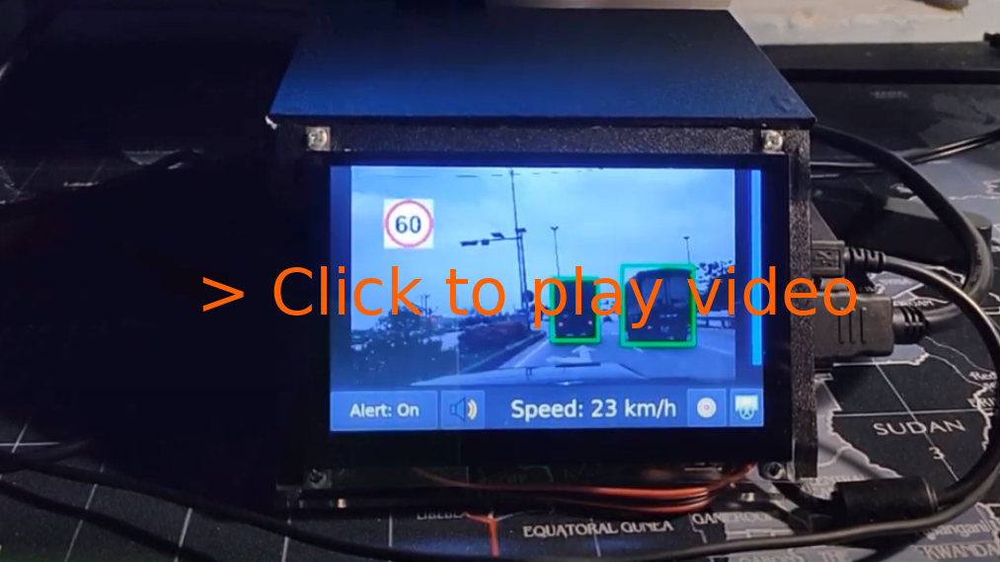

# OpenADAS - An advanced driver-assistance system using Jetson Nano

An advanced driver-assistance system on Jetson Nano embedded computer with four main functions: forward collision warning, lane departure warning, traffic sign recognition and overspeed warning. This repository contains source code for Jetson Nano, not including the source code for model training and conversion.

[](https://www.youtube.com/watch?v=0ykWIfkZxmY)


## Documentation:

- **(Blog) Intro and Hardware:** <https://aicurious.io/posts/adas-jetson-nano-intro-and-hardware/>.
- **(Blog) Software stack**: <https://aicurious.io/posts/adas-jetson-nano-software/>.
- **(Blog) Deep neural networks:** <https://aicurious.io/posts/adas-jetson-nano-deep-neural-networks/>.
- **(Documentation) OpenADAS:** *Design, CANbus, Calibration, Model training and deployment notes*: [docs/open-adas.md](docs/open-adas.md).
- **(Documentation) How to setup on a Jetson Xavier:** [docs/setup-jetson-xavier.md](docs/setup-jetson-xavier.md).

**For TensorRT 7 support:** Currently, only TensorRT 5 and 6 are supported. TensorRT 7 has a lot of deprecated APIs and I think there is no way to run this project directly with that version. I don't have time to continue with this project soon, so I really need your contributions to extend this project further.

## Quick setup on Jetson Nano: SD Card image

I created an image of my SD card [here](https://drive.google.com/file/d/1jg68ySnTt4Zm_hb4JVZKKWXRWkDucqUu/view?usp=sharing). You can flash and run this image on Jetson Nano.

**Note:**

- The source code and binary files in this SD card image is older than in `master` branch. Please upgrade to the lastest source code and recompile on your device.
- Use Alt+F4 to exit the GUI and start editing your source code.
- Login information:
    + Username: `smartcam`.
    + Password: Open Terminal and type `sudo passwd smartcam` to change the password.

## Compile from source

### Requirements:

- CMake >= 3.10
- Qt 5
- OpenCV >= 4.0.1
- C++ 17 compiler
- CUDA 10.1
- TensorRT 5.1.5-1+cuda10.1, or - TensorRT 6.0.1.8+10.2. **This project should work with TensorRT 5 and TensorRT 6. TensorRT 7 is not supported for now.**

### Setup for Linux - Ubuntu 18.04

#### Setup

- Install QT:

```
sudo apt-get install build-essential
sudo apt-get install qt5-default qtcreator qt5-doc qt5-doc-html qtbase5-doc-html qtbase5-examples -y
sudo /sbin/ldconfig -v
```

- Install OpenCV

```
https://linuxize.com/post/how-to-install-opencv-on-ubuntu-18-04/
```

- Install protobuf 3.6.1

```
https://github.com/protocolbuffers/protobuf
```

#### Models and test data

- Download models and testing data [here](https://drive.google.com/drive/folders/1-DDchZQNOWpppNX8udyKj0OViDhYD38O?usp=sharing) and put into root folder of this project.

#### Compile and Run

- Update `GPU_ARCHS`: Modify `GPU_ARCHS` in `CMakeLists.txt` to suit your GPU. For Jetson Nano, GPU_ARCHS = 53 and for my RTX 2070, GPU_ARCHS = 75. Read more in following posts:
  + <https://www.programmersought.com/article/28125950847/>
  + <https://arnon.dk/matching-sm-architectures-arch-and-gencode-for-various-nvidia-cards/>

- Compile
```
cd <project directory>
mkdir build
cd build
cmake -DCUDA_INCLUDE_DIRS=/usr/local/cuda-10.1/include ..
make
```

- Setup virtual CAN (run once)

```
sudo bash setup_vcan.sh
```

- Run
```
./OpenADAS
```

This will starts the program in full screen and touch mode. If you want to use a computer mouse, add `--on_dev_machine` option:

```
./OpenADAS --on_dev_machine
```

#### Known issues

**Issue: cublas_v2.h not found**

```
fatal error: cublas_v2.h: No such file or directory
 #include <cublas_v2.h>
          ^~~~~~~~~~~~~
compilation terminated.
```

- Step 1: Find lib: `find /usr/local/ -name cublas_v2.h`.
- Step 2: Export to path: `export CPLUS_INCLUDE_PATH=$CPLUS_INCLUDE_PATH:/usr/local/cuda-10.2/targets/x86_64-linux/include/`.
- Step 3: Use CMake and build.

**Issue:  `/usr/bin/ld: cannot find -lcudart`, `/usr/bin/ld: cannot find -lcublas`**

```
sudo ln -s /usr/local/cuda/lib64/libcudart.so /usr/lib/libcudart.so
```
```
sudo ln -s /usr/local/cuda/lib64/libcublas.so /usr/lib/libcublas.so
```

**Note:** The paths can be different on your computer.

**Issue: Qt5Multimedia missing**

```
Could not find a package configuration file provided by "Qt5Multimedia"
  with any of the following names:

    Qt5MultimediaConfig.cmake
    qt5multimedia-config.cmake
```

How to fix?

```
sudo apt-get install qttools5-dev-tools libqt5svg5-dev qtmultimedia5-dev
```

**Issue:  Need to specify CUDA root**

```
[cmake] CMake Error at /usr/share/cmake-3.10/Modules/FindCUDA.cmake:682 (message):
[cmake]   Specify CUDA_TOOLKIT_ROOT_DIR
```

How to fix? 

```
export CUDA_TOOLKIT_ROOT_DIR=/usr/local/cuda-10.2/
```

You should change the path corresponding to your environment.

**Issue: Qt5 library not found**

```
 fatal error: QtWidgets/QCloseEvent: No such file or directory
 #include <QtWidgets/QCloseEvent>
          ^~~~~~~~~~~~~~~~~~~~~~~
compilation terminated.
```

**Issue: SIOCGIFINDEX: No such device**

```
sudo bash setup_vcan.sh
```

## References:

- Dark Theme for Qt5 by Juergen Skrotzky: [https://github.com/Jorgen-VikingGod/Qt-Frameless-Window-DarkStyle](https://github.com/Jorgen-VikingGod/Qt-Frameless-Window-DarkStyle).

- ICSim: <https://github.com/zombieCraig/ICSim>.
