# OpenADAS Documentation

**Github:** <https://github.com/vietanhdev/open-adas>

## I. Project scope

This project is a prototype of an advanced driver assistance system, focusing on perception algorithms (object detection, lane line segmentation and traffic sign classification). It provides 3 main functions:

- Forward collision warning
- Lane departure warning
- Traffic sign detection and over-speed warning

It also provide a **limited** virtual hardware access as a step toward a commercial product:

- GPS reader through a GPS source in LAN
- A CAN reader to read car speed and turn signal from a virtual can bus

However, GPS and CAN signals can be collected using a GPS module or a CAN-to-USB cable. I will provide some instructions on how to setup these devices.

## II. Hardware setup

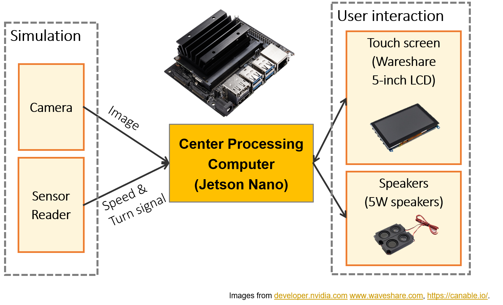

The center component to process all inputs of this project is a Center processing computer. This computer receives two inputs: (i) images from a camera, and (ii) car sensor data such as car speed and turn signal. It takes responsibility to process these inputs to issue warnings when needed. In the scope of this project, due to the limited experimental condition, we implemented a **simulation module to provide alternatives to the camera and the sensor reader inputs**. In a commercial product, the sensor reader module can be implemented with a GPS module and a CAN bus reader (for example CAN to USB cable); camera input can be provided using a USB camera.

**Hardware list:**

- Jetson Nano Developer Kit
- Sandisk Ultra 64GB class-10 SD card
- Wareshare 5-inch LCD touch screen
- Wareshare 8Ω 5W Speaker
- 2-inch 5V cooling fan for Jetson Nano
- Acrylic clear case.

### 1. How to get car sensors (speed, turn signal)

#### Use a GPS module

**For development and educational purpose:**

- Shared GPS from your mobile phone:
    + Download **Share GPS** application from Google Play Store.
    + Setup your mobile phone LAN address in `src/sensors/car_gps_reader.cpp` and use this app to share GPS information with your Jetson Nano. In this way, we can obtain GPS signal and estimate the car speed.
- Use a USB GPS receiver: <https://www.amazon.com/GlobalSat-BU-353-S4-USB-Receiver-Black/dp/B008200LHW>.

**For a commercial product:**

- See into this module: <https://www.adafruit.com/product/746>. Accuracy: < 3m.

#### How to setup a CAN bus to read car speed and turn signal

**General info**

In this project, We didn't setup a physical CAN bus on a real car (only a simulation system using socket CAN). However, it can be achieved by using a CAN-to-USB cable. 

Some information about CAN bus:

- General information: <https://www.csselectronics.com/screen/page/simple-intro-to-can-bus/language/en>.
- How to hack into your vehicle?: hacking-can-bus.pdf
- Open source CAN cable: CANtact. This will support you to connect the CAN bus to a linux socket, **which is already supported by my ADAS source code**.
    + Hardware design: <https://github.com/linklayer/cantact-hw>
    + Firmware: 
    + In Korea: <http://vctec.co.kr/product/cantact-%EC%98%A4%ED%94%88%EC%86%8C%EC%8A%A4-canusb-%EC%BB%A8%EB%B2%84%ED%84%B0-cantact-open-source-can-to-usb-converter/11137/category/161/display/1/>
    + You will also need OBD-II to DB9 Cable to connect with the car OBD-II: <http://vctec.co.kr/product/obd-ii-%EC%BC%80%EC%9D%B4%EB%B8%94obd-ii-to-db9-cable/817/category/81/display/1/>.
    + Once the CAN messages from the vehicle have been processed by the CANtact device, they are output through a USB Type B port. This, therefore, requires a USB-B to USB-A cable: <https://www.amazon.com/AmazonBasics-USB-2-0-Cable-Male/dp/B00NH11KIK>

**Where can we find the CAN bus line to connect into?**

In this project, we only worked with a virtual CAN bus so the project source code still hasn't supported a real connection to a car CAN bus. Unfortunately, although CAN bus is a standard of automotive industries, if you want to find where is your can lines, you often need to look into your car electrical diagram to find the internal CAN bus. Since 1996, there is a automotive standard called OBD2 that can provide a convenient way to connect to CAN bus. You can find the information about OBD2 in following link:

<https://www.csselectronics.com/screen/page/simple-intro-obd2-explained/language/en>

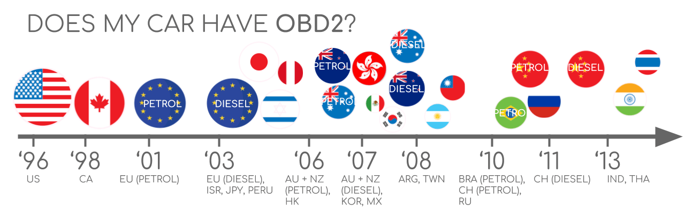

**Where is the OBD2 port?**

The OBD-II port is usually located under the dashboard, beneath the steering wheel column (1 - 3 in the diagram below). If not located beneath the steering column, look for the port in the areas indicated by numbers 4 - 9.

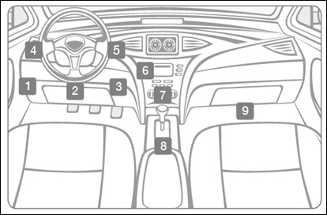

**How can I reverse the CAN engineering and read the speed?**

**Resources:**

+ [hacking-can-bus.pdf](hacking-can-bus.pdf)
+ https://fabiobaltieri.com/2013/07/23/hacking-into-a-vehicle-can-bus-toyothack-and-socketcan/

You can use Wireshark or candump to find where is the vehicle speed and turn signal. CAN bus is not encrypted, so you can depend on the instruction below and try to find it.

### 2. How to calibrate the camera

After connecting a USB camera to the Jetson Nano board, we need to run the OpenADAS software to calibrate the camera. The calibration is actually for perspective transform based distance estimation. This is a convenient way to calibrate a camera for the distance calculation.

The transformation parameters include the meter-to-pixel mapping from the real-world distances to the bird view image space and the perspective transform matrices between the bird view image to the camera image. In order to calculate these parameters, We use following solution: put a red carpet in the front of the car, measure distances W1, W2, L1, L2. The carpet should be large enough and must be put symmetrically across the long axis of the car.

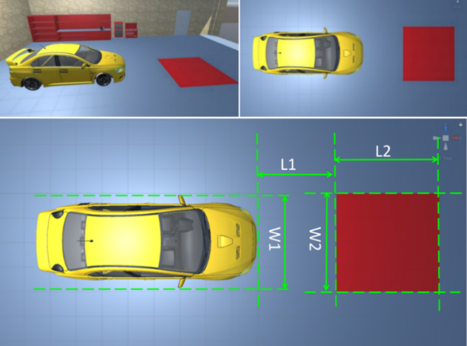

Click the setup button to open camera calibration.

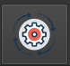

Enter L1, L2, W1, W2 into the UI.

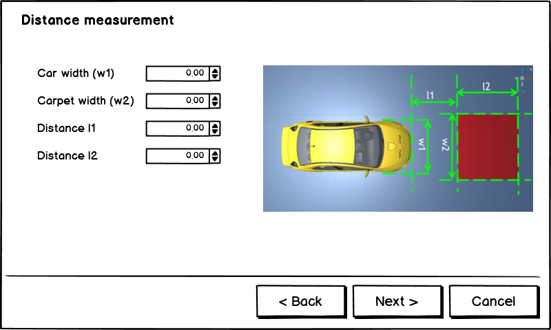

After that, pick 4 points by click **Retake photo**, pick a point and move the sliders. These points must be pick in correct order. When the camera has been calibrated, the calibration file will be saved in `data/camera_calib.txt` and will be loaded back every time the program is launched.

## III. Perception models and algorithms

### 1. Object detection and traffic sign classification model

This Object Detection Module is responsible for detect front obstacle objects such as other vehicles or pedestrians, and traffic signs. These results can be used for forward collision warning and over-speed warning. To provide these functions, the module contains two main components: a CenterNet based object detection neural network and a ResNet-18 based traffic sign classification network. Therefore, we will see 2 deep learning models in following diagram.

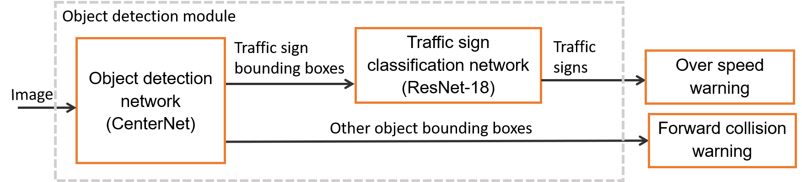

#### 1.1. Object detection with CenterNet

CenterNet is a simple but efficient model for object detection. In comparison with other popular object detection models, CenterNet can adapt very efficiently for speed-accuracy tradeoff. Unlike other popular anchorbox-based object detection networks, CenterNet relies on a keypoint detector to detect the center of the object, then regress other properties.

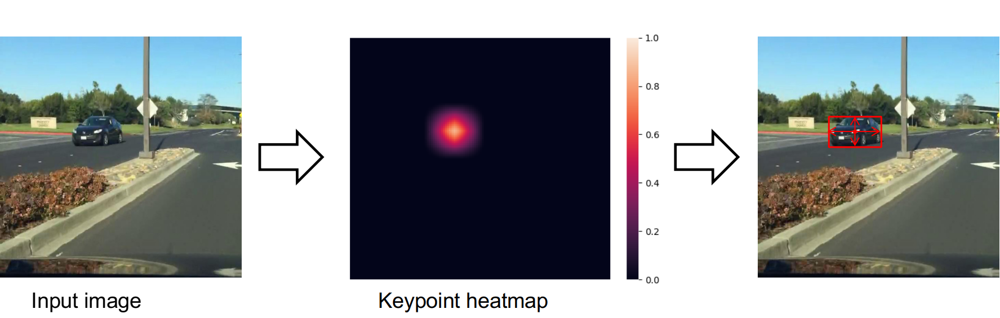

- **Paper:** Objects as Points - Xingyi Zhou, Dequan Wang, Philipp Krähenbühl <https://arxiv.org/abs/1904.07850>.
- **Official Repo:** <https://github.com/xingyizhou/CenterNet>.

**Training**

I use the official repository from CenterNet's authors to train the object detector (with some modifications). Please read the installation steps [here](https://github.com/xingyizhou/CenterNet/blob/master/readme/INSTALL.md) to install the required environment for training.

**NOTES:**

- I recommend using Anaconda or Miniconda to create a virtual environment for each task. Don't mix your environments because we have to use different Python and packages versions.
- You **must use** PyTorch v0.4.1 and setup it as the instruction here: <https://github.com/xingyizhou/CenterNet/blob/master/readme/INSTALL.md>. Other versions are not guaranteed to work.

I modified the official repository to work with Berkeley DeepDrive (BDD) dataset](https://bdd-data.berkeley.edu/). You can clone the source code [here](https://github.com/vietanhdev/centernet-bdd-data) to start training. In my reposity, I trained CenterNet with 10 classes: `person`, `rider`, `car`, `bus`, `truck`, `bike`, `motor`, `traffic light`, `traffic sign` and `train`.

**Model optimization using TensorRT**

After training CenterNet using PyTorch framework, we obtain model files in PyTorch model format (.pth). In order to optimize inference speed on NVIDIA Jetson Nano, we need to convert these models to TensorRT engine file. The conversion is done via an intermediate format called ONNX (Open Neural Network Exchange). PyTorch model is converted to ONNX format first using PyTorch ONNX module (step 1). After that, we convert ONNX model to TensorRT engine for each inference platform (step 2). Because the conversion from ONNX to TensorRT engine takes a long time, in my implementation, I serialize TensorRT engine to hard disk after converting and load it every time the program starts. In this step, we have to notice that TensorRT engine is built differently on different computer hardware. Therefore, we need to rebuild the engine if we need to inference on other hardware configuration.

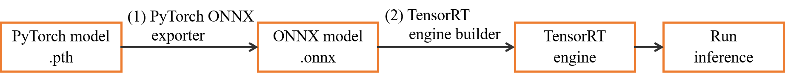

Use this repository to convert pretrained models into ONNX format: <https://github.com/vietanhdev/centernet-bdd-data-onnx-conversion>.

**NOTE:**

- Create another virtual environment, which is different from training. This new Python environment should use Pytorch v1.0 or v1.1. I prepared a repository for this conversion task above. You can use the instruction [here](https://github.com/vietanhdev/TensorRT-CenterNet/blob/master/readme/ctdet2onnx.md) to setup your own environment.
- You can read some example source code for the conversion in `convert_to_onnx_mobilenet.py` (for MobileNetv2 backbone) and `convert_to_onnx_rescdn18.py` (for ResNet-18 backbone) from [this folder](https://github.com/vietanhdev/centernet-bdd-data-onnx-conversion/tree/master/src).
- After having a ONNX model, go to OpenADAS to update the path to that new object detection model in the configuration file: `src/configs/config_object_detection.h`. You can also use [this repository](https://github.com/vietanhdev/TensorRT-CenterNet/) for the conversion.

#### 1.2. Traffic sign classification

Due to the limitation of **BDD dataset** - It's only contains 1 class for traffic signs (without specifying the sign type), I had to train another neural network to recognize sign types. Because of the high speed and accuracy, **ResNet-18** was also chosen for this task. I trained the model using Tensorflow and Keras frameworks.

**Dataset**

In this project, I only design the system to classify maximum speed signs, and I treat each speed level as a separate object class. In order to collect enough data for training, I use 2 datasets: Mapillary Traffic Sign Dataset (MTSD) and German Traffic Sign Recognition (GRSRB) dataset. As MTSD is a traffic sign detection dataset, I use sign bounding boxes to crop them for classification task. After cropping, I merge 2 datasets and have 18,581 images of maximum speed limit traffic signs divided into 13 classes, and 879 end of speed limit signs (treating all end of speed limit signs as only 1 class). Besides, I use 20,000 crop images from other traffic signs and objects for “unknown” class. In total, there are 15 classes in this dataset: maximum speed signs (5km/h, 10km/h, 20km/h, 30km/h, 40km/h, 50km/h, 60km/h, 70km/h, 80km/h, 90km/h, 100km/h, 110km/h, 120km/h), end of speed limit (EOSL) and other sign (OTHER). After that, this dataset is divided into 3 subsets: training set (80%), validation set (10%) and test set (10%). The distribution is randomly for each traffic sign class.

**Training steps**

Use the source code in this repository to train the traffic sign classifier: <https://github.com/vietanhdev/traffic-sign-classification-uff-tensorrt>.

- **Step 1: Initialize environment**

Create anaconda enviroment:

```conda create --name <ENVIROMENT_NAME> python=3.6```

Activate created environment and install all requirements:

```pip install requirements.txt```


- **Step 2: Train the models**

Prepare dataset like below structure:

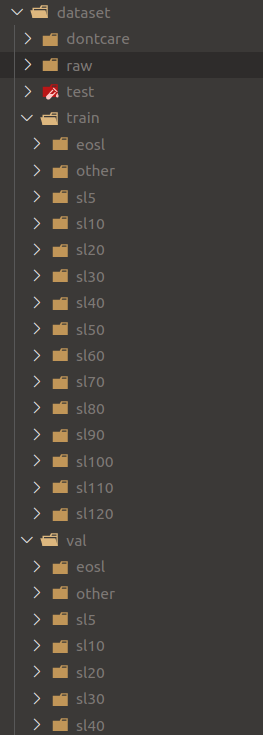

Train the model with following command:

```
python train.py
```

**Model optimization using TensorRT**

*Convert to UFF*

- Modify model paths in `convert_h5_to_pb.py` and `convert_pb_to_uff.py`.

- Convert `.h5` model to `.pb`, and finnally `.uff`: 

```
pip install requirements-h5-to-uff.txt
python convert_h5_to_pb.py
python convert_pb_to_uff.py
```

- After having a ONNX model, go to OpenADAS to update the path to that new traffic sign classification model in the configuration file: `src/configs/config_sign_classification.h`.

### 2. Lane line segmentation model

Lane line detection module takes responsibility to detect lane lines and lane departure situation. This result is then used for lane departure warning. I use a deep neural network and Hough transform line detector for lane line detection. The pipeline of lane line detection is described below.


<p style="text-align: center; font-weight: bold;">Lane line detection pipeline</p>

#### U-Net model for lane line segmentation

U-Net is a fully convolutional network that works well in biomedical image segmentation, it can demonstrate high-precision segmentation results with less training image data. I applied U-Net to lane line segmentation problem and combined with Hough transform to find lane lines in form of line equations.


<p style="text-align: center; font-weight: bold;">U-Net model</p>

In order to have a light-weight segmentation model to run on embedded hardware, I had two modifications with the original U-Net model: 

- (1) adjust number of decoder filters to 128, 64, 32, 16, 8 filters from the top of decoder to the output of the network;

- (2) replace the original backbone with ResNet-18 backbone.

These modifications reduce the number of parameters in U-Net and give us a light-weight model which can run at over 200 frame per seconds (FPS) (model U-Net ResNet-18 input size 384x382, TensorRT float 16 on RTX 2070 GPU).

#### Dataset

Dataset is prepared from [Mapillary Vista dataset](https://www.mapillary.com/dataset/vistas) with some modifications. The original dataset contains about 18000 images in training set and about 2000 images in validation set. I merge these sets, remove a number of images which do not contain lane line or have too much noise. The final dataset has 15303 images. I split this set randomly into three subsets: 10712 images for training (~70%), 2296 images for validation (~15%) and 2295 images for test (~15%). Because the label of Mapillary Vista contains many object classes, I keep only lane line class to generate binary segmentation masks as the new label.

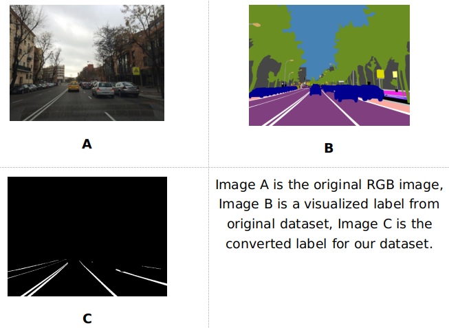

<p style="text-align: center; font-weight: bold;">Mapillary Vistas dataset preprocessing – Images A, B are from Mapillary Vitas</p>


#### Training

Use my repository to train U-Net for lane line segmentation: <https://github.com/vietanhdev/unet-uff-tensorrt>.

- **Step 1: Initialize environment**

Create anaconda enviroment:

```conda create --name <ENVIROMENT_NAME> python=3.6```

Activate created environment and install all requirements:

```pip install requirements.txt```


- **Step 2: Train the models**

Create new config file in ```list_config``` directory Please don't modify old config file, so we can have better observation, model and training history will be auto saved into ```saved_models``` folder.

For training, simply run:

```python model/train.py```

or

```./train.sh```
#### Model optimization using TensorRT

*Convert to UFF*

- Create another virtual environment for this task.

- Modify model paths in `convert_h5_to_pb.py` and `convert_pb_to_uff.py`.

- Convert `.h5` model to `.pb`, and finnally `.uff` using these commands (please update the right paths to the models in `convert_h5_to_pb.py` and `convert_pb_to_uff.py`)

```
pip install requirements-h5-to-uff.txt
python convert_h5_to_pb.py
python convert_pb_to_uff.py
```

- After having a UFF model, go to OpenADAS to update the path to that new model in the lane detection configuration file: `src/configs/config_lane_detection.h`.

#### Lane line detection with Hough transform

Hough Transform is a line detection algorithm that is quite effective in image processing. The general idea of this algorithm is to create mapping from image space (A) to a new space (B) that each line in space (A) corresponds to a point in space (B), each point in space (A) corresponds to a sinusoid in space (B). After projecting all points in (A) into sinusoids in space (B), we find the places with the highest intersection point density. These places then are projected to (A) into lines. By this way, Hough line transform algorithm can find lines in image space (A).

The progress to find lane line candidates is shown in following figure. From segmentation mask produced by line segmentation network, lane line detection module uses probabilistic Hough transform to detect raw line segments (1). After that, these lines are partitioned into groups using disjoint-set/union-find forest algorithm inverted by Bernard A. Galler and Michael J. Fischer in 1964. We use spatial distance and angle difference between lines to group line segments which belong to a same line. After step (2), we can see that different line groups are drawn in different colors. Step (3) receives these line groups as the input and fit a line through each group using maximum-likelihood estimation with L2 distance.

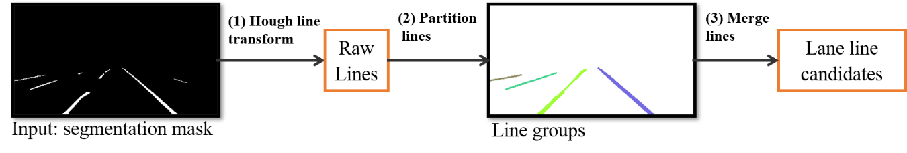

<p style="text-align: center; font-weight: bold;">Line candidate detection</p>

Combining lane segmentation model with above lane detection algorithms, this system can detect lane lines in different environments and determine lane departure situation. It creates a reliable input for lane departure warning module.

### 4. Warning rules

This system uses rule-based warning algorithms. Please see some warning rules in following blog post and in the source code:

<https://aicurious.io/posts/adas-jetson-nano-software/#iii-software-implementation>

## References

- Read more about my results of deep neural networks here: <https://aicurious.io/posts/adas-jetson-nano-deep-neural-networks/>.


